# Clinic IT Modernization (AWS + Terraform + Linux + Flask + PostgreSQL)

A hands-on cloud infrastructure project simulating the modernization of a small medical clinic’s legacy intake system into a secure, cloud-hosted web application.

This project demonstrates practical **IT infrastructure**, **cloud**, **Linux administration**, **web application hosting**, **monitoring**, and **security hardening** skills using AWS and Terraform.

---

## Project Overview

A small medical clinic needs to modernize its patient intake workflow.

Instead of relying on paper forms or a legacy on-prem setup, this project deploys a lightweight web-based intake application to AWS with a more production-style architecture.

### Business Goals
- Host a clinic intake application in the cloud
- Store patient intake submissions in a managed relational database
- Improve security by restricting direct access to the application server
- Add monitoring and alerting for operational visibility
- Build infrastructure as code for repeatable deployment

---

## Final Architecture

This project currently deploys:

- **Route 53** hosted DNS for the application domain
- **AWS Certificate Manager (ACM)** for HTTPS
- **Application Load Balancer (ALB)** for secure public web access
- **Auto Scaling Group (ASG)** for the application server tier
- **EC2 instance(s)** running:
  - Amazon Linux 2023
  - Flask application
  - Gunicorn
  - Nginx reverse proxy
- **Amazon RDS PostgreSQL** in private subnets
- **AWS Systems Manager Parameter Store** for configuration / secret handling
- **CloudWatch Logs** for Nginx logging
- **CloudWatch Alarms** for basic monitoring
- **SNS notifications** for alerts
- **CloudWatch Dashboard** for visibility
- **Terraform** for infrastructure provisioning

### Current Request Flow

User / Browser  
→ Route 53 DNS  
→ HTTPS (ACM Certificate)  
→ Application Load Balancer  
→ EC2 (Nginx reverse proxy)  
→ Gunicorn  
→ Flask app  
→ Amazon RDS PostgreSQL

---

## Architecture Diagram

> Add your finalized architecture diagram here once created in Draw.io.

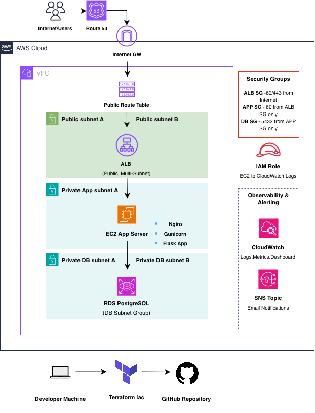

---

## Tech Stack

### Cloud / Infrastructure
- AWS VPC
- AWS EC2
- AWS RDS PostgreSQL
- AWS Application Load Balancer
- AWS Security Groups
- AWS CloudWatch
- AWS SNS
- AWS Systems Manager Session Manager
- Route 53 (prepared for DNS / HTTPS path)
- AWS Certificate Manager (planned/attempted for HTTPS)

### Infrastructure as Code
- Terraform

### OS / Server
- Amazon Linux 2023
- Nginx
- Gunicorn
- systemd

### Application
- Python
- Flask
- HTML / CSS
- PostgreSQL
- psycopg2

---

## Key Skills Demonstrated

- Provisioned AWS infrastructure with **Terraform**
- Deployed and hosted a Python Flask application on **EC2**
- Configured **Nginx** as a reverse proxy to Gunicorn
- Migrated app persistence from local SQLite to **Amazon RDS PostgreSQL**
- Secured the architecture by placing the database in **private subnets**
- Restricted direct app access so traffic flows through the **ALB**
- Used **Session Manager** instead of relying on SSH
- Configured **CloudWatch Logs**, **CloudWatch Alarms**, and **SNS**
- Built a **CloudWatch Dashboard** for operational monitoring
- Troubleshot real infrastructure issues including:
  - security group behavior
  - EC2 replacement on Terraform apply
  - Nginx reverse proxy issues
  - ALB listener configuration
  - DNS / Route 53 / Cloudflare authority conflicts
  - HTTPS readiness planning

---

## Project Structure

```bash
clinic-it-modernization/
├── app/
│   ├── app.py
│   ├── requirements.txt
│   ├── templates/
│   │   ├── intake.html
│   │   └── admin.html
│   └── static/
│
├── infra/
│   ├── main.tf
│   ├── variables.tf
│   ├── outputs.tf
│   └── versions.tf
│   

│
├── docs/
│   └── images/
│
├── .gitignore
└── README.md
```

---

## Infrastructure Components

## 1. Networking
- Custom **VPC**
- Public subnet(s) for internet-facing resources
- Private subnet(s) for the database
- Internet Gateway
- Route tables and subnet associations

## 2. Compute Layer
- **EC2 instance** running Amazon Linux 2023
- Bootstrapped with user data / provisioning steps
- Hosts:
  - Flask app
  - Gunicorn
  - Nginx

## 3. Database Layer
- **Amazon RDS PostgreSQL**
- Database deployed in **private subnets**
- App connects using environment variables
- Intake form submissions stored in relational database

## 4. Load Balancing
- **Application Load Balancer**
- Public entry point for the application
- Forwards traffic to EC2 target group
- Improved architecture over directly exposing Flask/Nginx to the internet

## 5. Monitoring & Alerting
- **CloudWatch Logs**
  - Nginx access logs
  - Nginx error logs
- **CloudWatch Alarms**
  - Basic health / operational alerting
- **SNS**
  - Email notifications for alarm events
- **CloudWatch Dashboard**
  - Centralized infrastructure visibility

---

## Security Design

This project includes several practical security improvements:

- **HTTPS enabled** using **AWS Certificate Manager (ACM)**
- **Route 53 DNS** configured for domain-based access
- **RDS is not publicly accessible**
- Database is isolated in **private subnets**
- Application traffic is routed through an **Application Load Balancer**
- EC2 HTTP access is restricted to the **ALB security group**
- Administrative access uses **AWS Systems Manager Session Manager**
- Sensitive configuration values are stored using **AWS Systems Manager Parameter Store**
- Direct database access is limited by **security groups**
- Sensitive values such as database passwords are excluded from Git

---

## Deployment Summary

### Initial MVP
The first version of the project deployed:
- EC2
- Flask app
- Gunicorn
- Nginx
- RDS PostgreSQL

### Enhancements Added
After MVP completion, the project was improved with:
- Nginx reverse proxy cleanup
- Application Load Balancer
- HTTPS using ACM
- Route 53 DNS integration
- Auto Scaling Group for the application tier
- Parameter Store for configuration / secrets handling
- CloudWatch Logs
- CloudWatch Alarms
- SNS alerting
- CloudWatch Dashboard


---

## Application Features

### Patient Intake Form
Users can submit:
- First name
- Last name
- Date of birth
- Phone
- Email
- Symptoms
- Preferred appointment date

### Admin View
The application includes a simple admin page to review stored intake records.

---

## Validation Performed

The following tests were successfully completed:

- Flask app ran successfully on EC2
- Nginx reverse proxy served the application correctly
- Form submission succeeded end-to-end
- Patient data was written to PostgreSQL in RDS
- ALB successfully routed traffic to EC2
- HTTPS was validated successfully using ACM + Route 53
- Port 5001 direct ingress was removed after reverse proxy validation
- CloudWatch logging captured Nginx logs
- SNS email subscription was received successfully
- CloudWatch Dashboard was created successfully

---

## Example Flow Tested

1. Open clinic intake application in browser
2. Submit patient form
3. Request is routed:
   - ALB
   - EC2 / Nginx
   - Gunicorn
   - Flask app
4. Data is written to PostgreSQL in RDS
5. Logs and monitoring capture application/server activity

---

## Screenshots

### Infrastructure & Architecture


### Terraform / Infrastructure Deployment
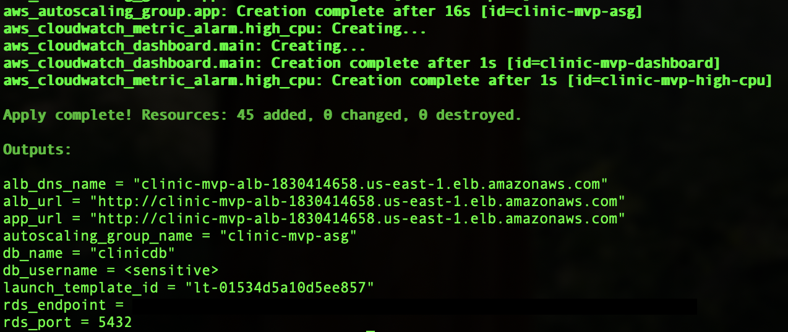

### AWS Console - EC2 Instance
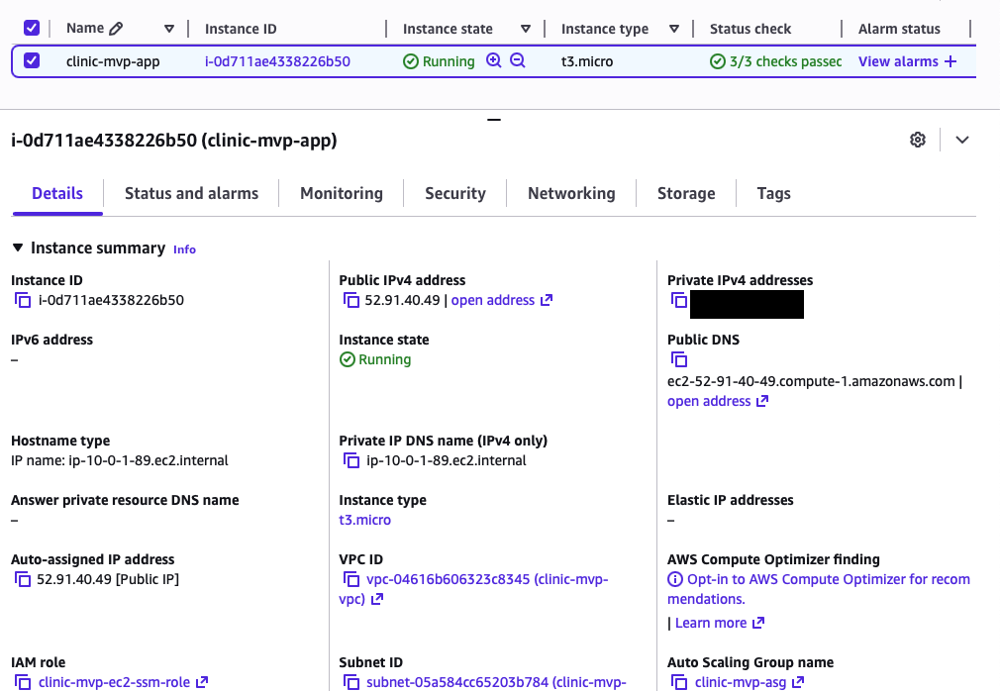

### AWS Console - RDS Database
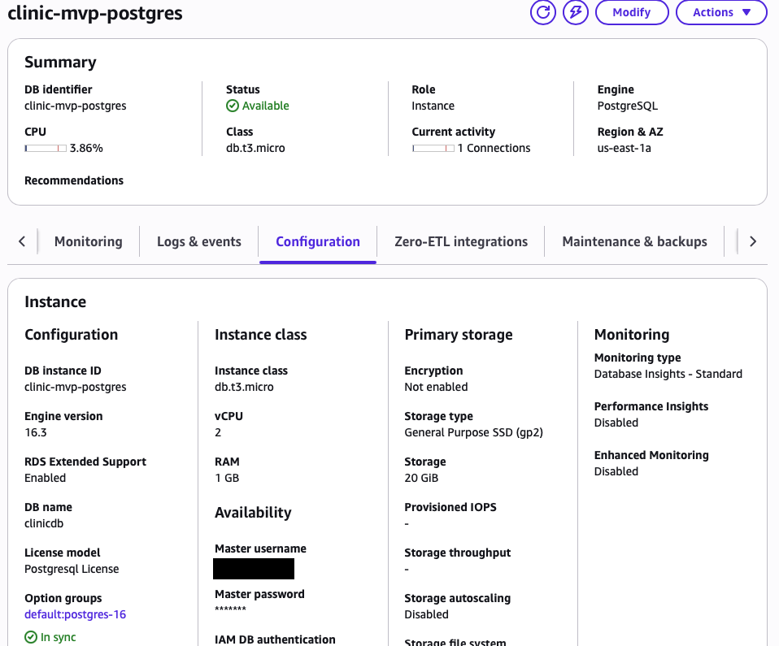

### AWS Console - Application Load Balancer
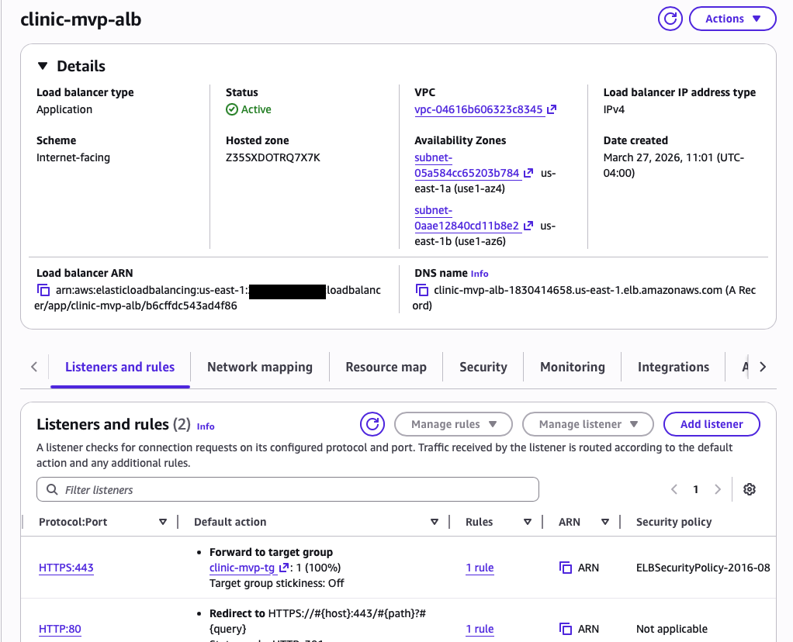

### Application Screens
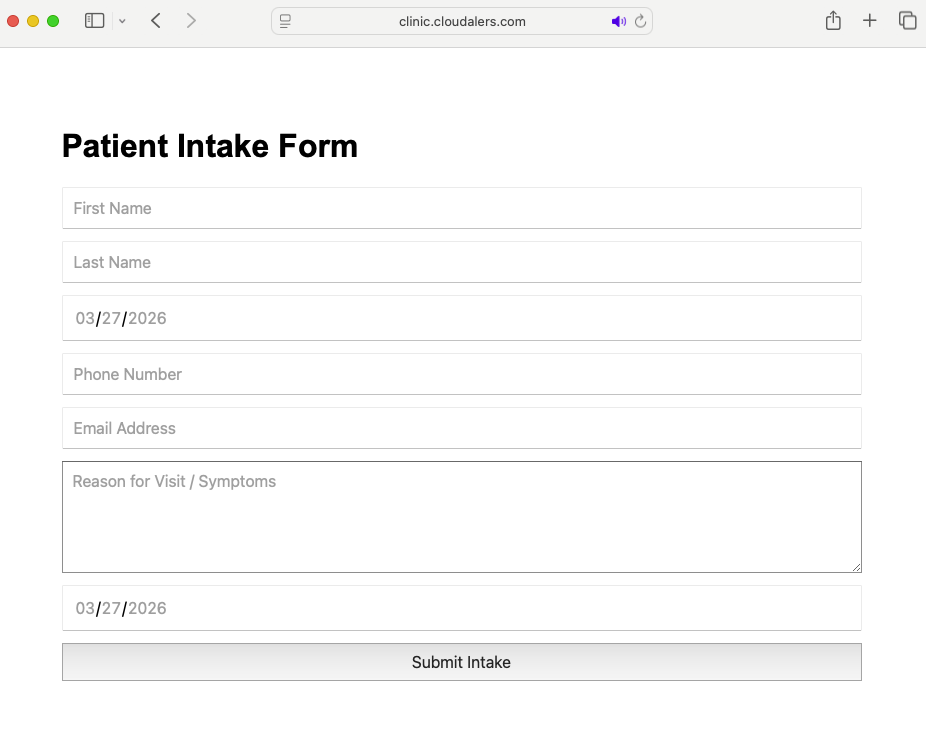

### Database Validation
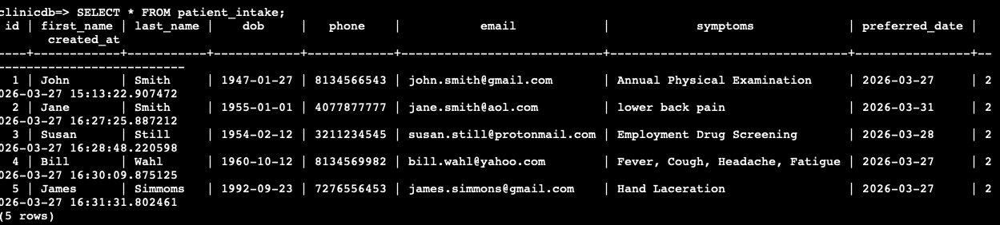

### Monitoring
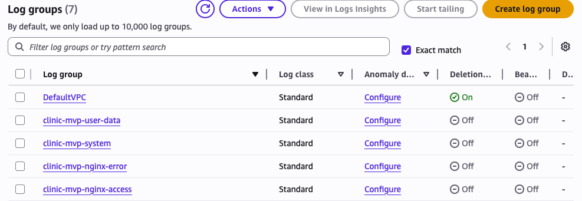

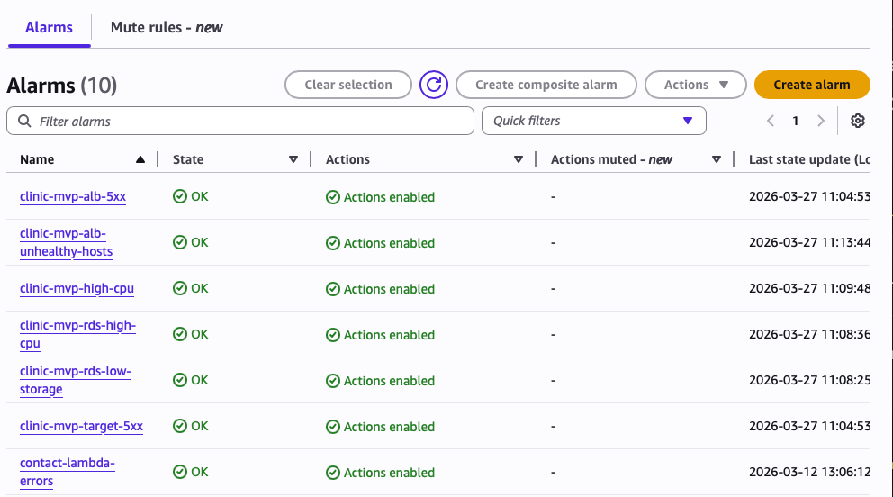

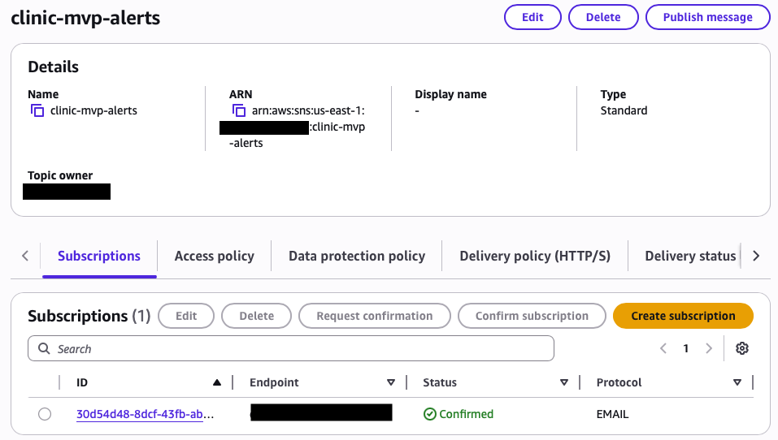

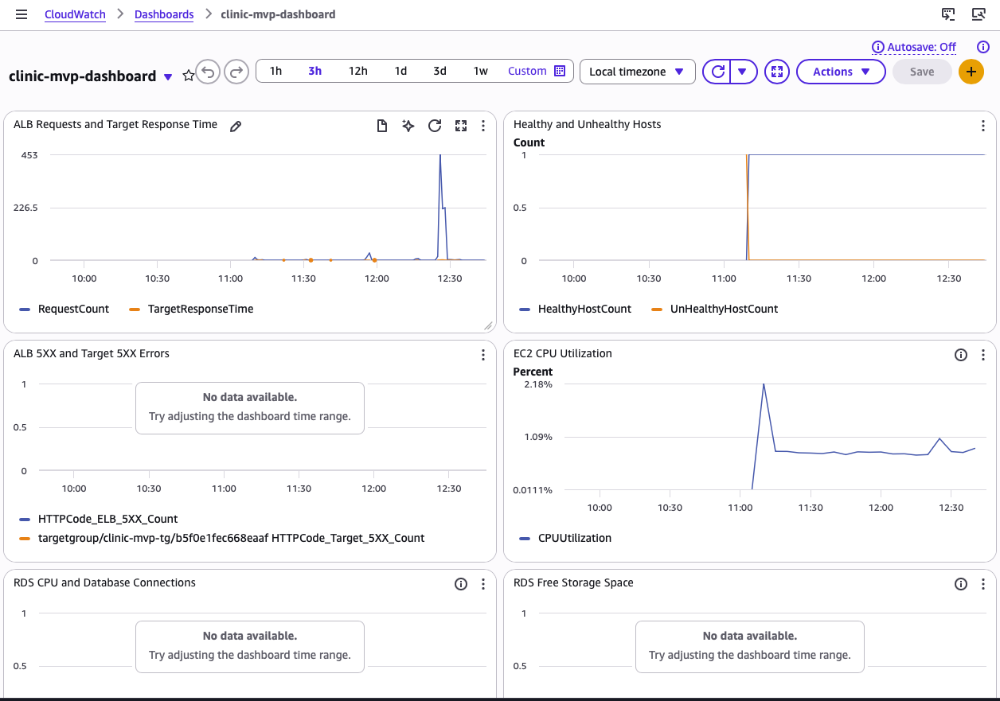

---

## Lessons Learned

This project helped reinforce several real-world cloud and infrastructure concepts:

- Why reverse proxies matter in application hosting
- How ALBs improve architecture and traffic handling
- The importance of separating public and private resources
- How to securely connect applications to managed databases
- How Terraform changes can unexpectedly replace resources
- How monitoring and alerting improve operational readiness
- How DNS and HTTPS can introduce real-world troubleshooting complexity

---

## Challenges Encountered

Some of the issues worked through during this project included:

- Flask port exposure and reverse proxy routing
- SSH access challenges and migration to Session Manager
- RDS connectivity and schema initialization
- Nginx configuration conflicts
- EC2 replacement after Terraform changes
- ALB listener setup
- Route 53 / Cloudflare nameserver authority conflicts during HTTPS setup

These troubleshooting steps were valuable because they mirror the kinds of problems often encountered in real environments.

---

## Future Improvements

Potential next improvements for this project:

- Move toward a more production-ready **CI/CD pipeline**
- Add application-level **health checks**
- Add **AWS WAF** or additional edge security controls
- Containerize the application with **Docker**
- Migrate the app to **Amazon ECS** in a future version
- Add **blue/green** or rolling deployment strategy
- Add **CloudWatch custom application metrics**
- Improve high availability further with a more production-style compute layer

---

## Why This Project Matters

This project was designed to simulate a realistic small-business IT/cloud modernization effort.

It demonstrates not just cloud provisioning, but also:
- infrastructure design
- Linux administration
- networking
- security controls
- database connectivity
- operational monitoring
- troubleshooting

That combination makes it a strong portfolio project for entry-level roles in:
- IT Support / Infrastructure
- Systems Administration
- Cloud Support
- Junior Cloud / DevOps Engineering

---

## References & Documentation

The following resources were used throughout the design, deployment, and troubleshooting of this project:

### AWS Documentation
- [AWS VPC Documentation](https://docs.aws.amazon.com/vpc/)
- [Amazon EC2 Documentation](https://docs.aws.amazon.com/ec2/)
- [Amazon RDS for PostgreSQL Documentation](https://docs.aws.amazon.com/AmazonRDS/latest/UserGuide/CHAP_PostgreSQL.html)
- [Elastic Load Balancing Documentation](https://docs.aws.amazon.com/elasticloadbalancing/)
- [AWS Certificate Manager Documentation](https://docs.aws.amazon.com/acm/)
- [Amazon Route 53 Documentation](https://docs.aws.amazon.com/route53/)
- [AWS Systems Manager Documentation](https://docs.aws.amazon.com/systems-manager/)
- [AWS Systems Manager Parameter Store Documentation](https://docs.aws.amazon.com/systems-manager/latest/userguide/systems-manager-parameter-store.html)
- [Amazon CloudWatch Documentation](https://docs.aws.amazon.com/cloudwatch/)
- [Amazon SNS Documentation](https://docs.aws.amazon.com/sns/)

### Terraform Documentation
- [Terraform AWS Provider Documentation](https://registry.terraform.io/providers/hashicorp/aws/latest/docs)
- [Terraform Language Documentation](https://developer.hashicorp.com/terraform/language)
- [Terraform CLI Documentation](https://developer.hashicorp.com/terraform/cli)

### Linux / Application Hosting References
- [Nginx Documentation](https://nginx.org/en/docs/)
- [Gunicorn Documentation](https://docs.gunicorn.org/en/stable/)
- [Flask Documentation](https://flask.palletsprojects.com/)
- [psycopg2 Documentation](https://www.psycopg.org/docs/)

### Supporting Concepts
- [AWS Well-Architected Framework](https://aws.amazon.com/architecture/well-architected/)
- [PostgreSQL Documentation](https://www.postgresql.org/docs/)
---

## Author

**Carlos Alers-Fuentes**  
AWS Certified Solutions Architect – Associate  
CompTIA Network+  

- GitHub: https://github.com/YOUR_GITHUB_USERNAME
- LinkedIn: https://www.linkedin.com/in/carlosalersfuentes

---